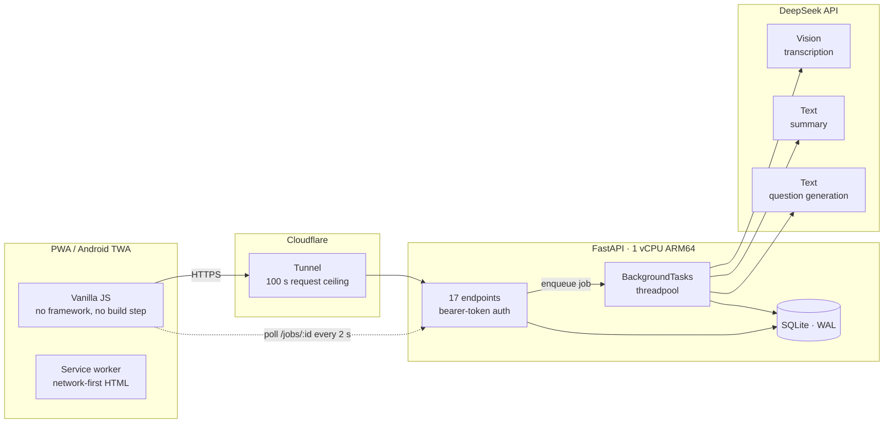

# Estudia

**Turn a photo of your handwritten class notes into a study summary and a multiple-choice exam.**

Point your phone at a page of notes. A vision model transcribes it — formulas in LaTeX,
diagrams described in prose — a second model condenses it into structured study material,
and a third writes exam questions at the difficulty you pick, each with an explanation of
why the right answer is right.

🔗 **Live:** [study.oscarnavarro.dev](https://study.oscarnavarro.dev) · 📱 Installable as a
PWA or as a signed Android APK · 🇪🇸 Spanish-language product

```
Python 3.12 · FastAPI · SQLite (WAL) · DeepSeek (vision + text) · Vanilla JS PWA
Docker on ARM64 · Cloudflare Tunnel · Android TWA
168 tests · no build step, no npm · ~5,300 LOC
```

---

## Table of contents

- [What it does](#what-it-does)
- [Architecture](#architecture)
- [Engineering highlights](#engineering-highlights)
  - [1. A three-stage LLM pipeline](#1-a-three-stage-llm-pipeline)
  - [2. Long-document handling (and why there is no vector database)](#2-long-document-handling-and-why-there-is-no-vector-database)
  - [3. Cost engineering](#3-cost-engineering)
  - [4. Long jobs on a flaky mobile connection](#4-long-jobs-on-a-flaky-mobile-connection)
  - [5. Authentication and multi-tenancy](#5-authentication-and-multi-tenancy)
  - [6. Security](#6-security)
  - [7. Testing strategy](#7-testing-strategy)
  - [8. Delivery](#8-delivery)
- [Security audit](#security-audit)
- [Running it](#running-it)
- [What I would do next](#what-i-would-do-next)

---

## What it does

| Step | What the user does | What the system does |
|---|---|---|
| 1 | Photographs 1–20 pages of notes | Downscales them in the browser (~4 MB → ~250 KB each) and uploads with a real progress bar |
| 2 | Waits (screen can sleep) | Transcribes each image with a vision model, then writes a proportional summary |
| 3 | Reads the summary | Markdown with LaTeX rendered by KaTeX; unreadable spots marked `[?]`, diagrams marked and set apart |
| 4 | Picks difficulty and question count | Generates multiple-choice questions in batches, as structured JSON |
| 5 | Takes the exam | Immediate feedback per question, with the reasoning; score history per topic |

Questions already seen are ranked last, so a second exam on the same topic is a new exam
and not a memory test.

---

## Architecture



**Layering.** `api.py` holds HTTP concerns only. `services/` holds the domain
(`ingesta`, `resumen`, `preguntas`, `examen`, `auth`, `limites`). `llm/` is the provider
boundary: a `LLMClient` **Protocol**, one real implementation, one fake. `ingest/` holds
image and PDF decoding. Nothing in `services/` imports FastAPI, which is why the domain is
testable without an HTTP client.

---

## Engineering highlights

### 1. A three-stage LLM pipeline

Each stage is a different job with a different prompt, a different model tier, and a
different failure mode.

| Stage | Model tier | Reasoning | Output | Why |
|---|---|---|---|---|
| Transcription | Vision, cheap | **off** | Faithful text + LaTeX | Copying is not reasoning. With reasoning on, the model spent its whole budget thinking and returned an empty string |
| Summary | Text, strong | **off** | Structured Markdown | Same failure: it burned 8,000 tokens reasoning and returned nothing (`finish_reason=length`), throwing away five perfect transcriptions |
| Questions | Text, strong | on | **Strict JSON** | Writing plausible distractors genuinely benefits from reasoning |

**Prompt design carries real product rules**, not just formatting:

- Transcription is told *never to guess*. Anything unreadable is marked `[?]`, because the
  original photo is discarded and an invented fact is worse than a gap. Diagrams become
  `[DIAGRAMA: ...]` blocks, rendered as distinct callouts so they are never mistaken for
  transcribed content.
- Question generation forbids *"according to the text…"* phrasing and requires distractors
  of similar length to the correct answer — otherwise the correct option is guessable from
  its shape alone. `[?]` content is excluded from questions.

**Structured output without structured-output APIs.** Models emit raw LaTeX inside JSON
strings (`"$\frac{a}{b}$"`), which is sometimes invalid JSON and sometimes *valid* JSON
that decodes to a control character. `preguntas.reparar_latex` walks the string and doubles
only the backslashes that are not legitimate JSON escapes — deliberately treating `\f` and
`\b` as LaTeX, since a literal form-feed has no meaning in study notes. Parsing is then
validated with Pydantic, with one retry before the job fails.

### 2. Long-document handling (and why there is no vector database)

> **Honest framing:** this project does **not** use RAG. There is no embedding model, no
> vector store, and no retrieval step — and adding one would have made the product worse.
> RAG exists to find the *relevant slice* of a corpus too large to read. Here the user
> uploads exactly the pages they want studied, and **every one of them must appear in the
> output**. Retrieval would silently drop content; the requirement is total coverage.

The real constraint is different: **the provider caps a single response at ~8,000 output
tokens**, and a faithful summary of 10,000 words is 5,500 words — which does not fit.

The first attempt capped the summary length. That was the wrong fix: it hit the ceiling by
discarding material, which is precisely what a study aid must not do. The measured result
from production was stark:

| Upload | Transcribed | Summary | Retained |
|---|---|---|---|
| 5 photos | 25,381 chars | 5,299 | **21 %** ❌ |
| 1 photo | 5,831 chars | 5,738 | 98 % ✅ |

The model, given no length target, wrote the same amount regardless of input — so five
times the input meant five times the compression.

The fix is **context-window-aware chunking**:

1. Compute a word target proportional to input (~55 %, no ceiling).
2. Pack documents greedily into blocks, each sized to fit one response.
3. A single document too large for one block splits by paragraph → line → word, never
   losing text.
4. Each block is one call. Only the **first** emits the `#` title; only the **last** emits
   the closing "key points" section. Blocks are stitched in order.
5. Progress is reported per block — the total is unknown until transcription finishes, so
   the job's `progreso_total` is corrected mid-flight.

```
   900 words →   500 (56 %) →  1 call
 4,532 words → 2,500 (55 %) →  2 calls
10,000 words → 5,500 (55 %) →  3 calls
25,000 words → 13,750 (55 %) → 10 calls
```

Blocks also carry `## Documento N de M` headers. Without them the model reads one running
text and fuses five distinct topics into a generic overview of one.

### 3. Cost engineering

This runs on a personal API balance, so cost is a first-class constraint, not an
afterthought.

- **Every call is metered.** `llm_calls` stores input/output tokens, model, step, the
  attributed user, and an estimated cost from a price table. Cost estimation deliberately
  applies the *higher* (marketplace) price to direct-API models — overestimating is the
  safe direction when the number feeds a spending cap.
- **Two ceilings, not one.** A global monthly cap protects the bill; a per-user cap stops
  the first stranger who registers from burning it and denying service to everyone else.
  Enforcement happens *before* work is enqueued, returning `402 Payment Required`.
- **Provider-direct instead of a marketplace**, saving the reseller margin. The client is
  written against the OpenAI-compatible shape with a configurable `base_url`, so switching
  providers to compare models is a one-line config change.
- **Images are downscaled twice** — in the browser to ~1600 px before upload, then to
  1100 px server-side. Vision tokens scale with pixels; the server would discard the extra
  resolution anyway, so paying to upload it was pure waste. This also shrinks the upload
  window, the only part of the flow that a dying phone connection can still interrupt.
- **Prompt layout for cache reuse.** Images go *before* the variable text in the message so
  the stable prefix is cacheable across calls.
- **Batch sizing derived from measurement, not guesswork.** A hard question costs ~1,200
  output tokens, so 20 per call overflowed `max_tokens` and returned invalid JSON. Ten
  leaves comfortable headroom — documented in the code next to the constant.

### 4. Long jobs on a flaky mobile connection

Processing takes minutes. **Cloudflare Tunnel cuts any HTTP request at 100 seconds**, so
nothing can be awaited inside a request.

- Work runs in Starlette `BackgroundTasks`; the client is handed a `job_id` and polls.
- **The original bug was on the client, not the server.** Users reported that locking the
  phone killed processing. The server was fine — the browser's polling loop had no error
  handling, so a single failed fetch ended it permanently. Fixed in three layers:
  1. Polling retries for ~5 minutes of network loss before giving up.
  2. `visibilitychange` re-polls *immediately* on wake instead of waiting out a timer that
     has been frozen for minutes.
  3. `GET /temas/:id/job` lets a cold client **re-attach** to a running job — so a
     discarded tab, a reload, or a reopened app resumes the progress bar with **no
     client-side state at all**.
- Interrupted jobs are closed at startup: after a restart, a `pendiente` job belongs to a
  process that no longer exists, and leaving it would poll forever.
- **Honest progress.** Ten questions arrive from the model in a single call, so a `0 / 10`
  counter physically cannot move — it read as a hang. It was removed in favour of an
  indeterminate bar, a running clock, and rotating status text naming the actual stage.
  The numeric counter stays only where progress is genuinely incremental.
- A run that never produces a summary **deletes its own topic**. A card reading
  "Processing… / No summary" is not a partial result, it is garbage.

### 5. Authentication and multi-tenancy

Username and password. No email, no recovery, no profile — deliberately minimal.

- **`hashlib.scrypt`** with a per-user salt, from the standard library — no compiling
  `bcrypt` on an ARM VM. ~100 ms per attempt.
- **Opaque session tokens**, one row per session, so signing in on a phone does not
  invalidate a laptop, and "Sign out" is a real revocation rather than a client-side
  forget.
- **Sessions expire after 180 days of inactivity and renew on use**, so an active user is
  never asked to log in again while a stolen token still has a bounded lifetime. The
  refresh writes at most once per day to avoid a write per read.
- **Login timing does not reveal whether an account exists** — the hash comparison runs
  even for unknown users.
- **Ownership is enforced on every endpoint**, and a topic belonging to someone else
  returns **404, not 403**: a non-owner has no business learning that it exists.
- Changing a password requires the current one and **closes every other device's session**
  while keeping the one that made the change.

### 6. Security

The application was audited against the Trail of Bits *insecure defaults* methodology
(fallback secrets, default credentials, fail-open switches, weak crypto, permissive access,
debug leakage) plus an OWASP-oriented review. Ten findings, all fixed and
regression-tested — [full table below](#security-audit).

The one worth reading about:

> **Stored XSS through the AI pipeline.** The transcription prompt instructs the model to
> copy *faithfully*. So photographing a sheet of paper reading
> `` puts that string in the
> transcription, the summary, and the topic title — and `marked` v15 passes raw HTML
> straight through (`sanitize` was removed in v8). With the session token in
> `localStorage`, that is account takeover from a photograph.
>
> Fixed by escaping all untrusted text before it reaches the DOM **and escaping the
> Markdown source before parsing it**, so no HTML can survive while Markdown and LaTeX keep
> working. A closed Content-Security-Policy (`script-src 'self'`, `object-src 'none'`,
> `connect-src 'self'`) is defence in depth: even a future injection would have nowhere to
> send data.
>
> `tests/xss_frontend.js` runs the real `marked` bundle and the real `app.js` against four
> payloads across five sinks. **Removing the escaping makes it report 19 live vectors.**

### 7. Testing strategy

**168 tests**, written test-first (`RED → GREEN`) throughout.

- **No test touches the network.** `FakeLLMClient` implements the same `Protocol` as the
  real client and records what it was asked, so prompt-construction rules are asserted
  directly: *does the summary disable reasoning?* *does only the first block request a
  title?* *does the length target scale with input?*
- **Contract tests** (`@pytest.mark.contrato`) hit the real provider and are deselected by
  default — the fast suite stays hermetic while the provider's actual behaviour is still
  verifiable on demand.
- **Every security fix has a regression test that fails without it** — verified by
  reverting the fix and watching the test fail, not assumed.
- **Production bugs become tests.** The migration that broke the container in production
  (a `CREATE INDEX` running before the `ALTER TABLE` that adds its column) is now a test
  that boots the app against the *old* schema. The local suite had missed it because every
  fixture starts from a fresh database.

### 8. Delivery

- **Docker** on an ARM64 Oracle Cloud VM (1 vCPU), single uvicorn worker — SQLite gains
  nothing from more. Runs as an unprivileged user.
- **Cloudflare Tunnel** — no inbound ports open; Cloudflare Access protects sibling
  projects on the same domain.
- **PWA**: web manifest, maskable icons generated programmatically
  ([`scripts/icono.py`](scripts/icono.py)), offline-capable shell.
- **Android APK** via Trusted Web Activity (Bubblewrap), signed locally, with
  `/.well-known/assetlinks.json` proving domain ownership so it opens **without a browser
  URL bar**. Web updates reach the installed app with no reinstall.
- **A caching bug worth naming.** Cloudflare caches `.js` by default, and the service
  worker pre-cached `index.html` and served it cache-first forever — so **deployments were
  silently never reaching the phone**. Two fixes that were already-shipped code the user
  could not see. Now: `Cache-Control: no-cache` from the origin for the app shell,
  versioned asset URLs, network-first for the HTML document, and
  `updateViaCache: "none"` on the service-worker registration to defeat the edge's 4-hour
  browser TTL.

---

## Security audit

Findings from the audit, each with the regression test that pins it.

| # | Severity | Finding | Fix | Test |
|---|---|---|---|---|
| F1 | **Critical** | Stored XSS via model-generated content and upload filenames → session-token theft | Escape every untrusted sink; escape Markdown before parsing; closed CSP | `tests/xss_frontend.js` |
| F2 | High | Cross-tenant leak: `responder` looked a question up by id alone, exposing another user's correct answer and explanation | Question must belong to the exam's topic | `test_no_se_pueden_leer_las_preguntas_de_otro_usuario` |
| F3 | High | No upload limits — file count, size, or pixels. A few-KB PNG declaring 60,000×60,000 exhausts the VM | 20 files, 12 MB each, 60 MB per batch, 40 Mpx per image | `test_una_bomba_de_descompresion_no_agota_la_memoria` |
| F4 | High | No brute-force protection on `/login` and `/registro` | 10 attempts / 15 min, keyed by IP **and** username; stored in SQLite so a restart cannot clear it; success clears the counter | `test_el_login_se_frena_tras_muchos_intentos` |
| F5 | High | Financial DoS: open registration with only a global spend cap | Per-call user attribution + per-user monthly cap | `test_un_usuario_no_puede_gastarse_el_saldo_de_todos` |
| F6 | Medium | No security headers | CSP, `nosniff`, `DENY`, Referrer-Policy, Permissions-Policy, HSTS | `test_la_app_manda_cabeceras_de_seguridad` |
| F7 | Medium | Sessions never expired — a stolen token was permanent access | 180-day inactivity expiry, renewed on use, swept at startup | `test_una_sesion_abandonada_caduca` |
| F8 | Medium | Container ran as root | Unprivileged `uid 10001` | verified in production |
| F9 | Low | Attacker-controlled filenames echoed into error messages | Length-capped and escaped | covered by F1 |
| F10 | Info | Prompt injection via photographed text | Bounded: the model has no tools and no agency; output is inert after F1 | — |

**Verified in production** after deployment: headers present, unauthenticated API returns
`401`, rate limiter trips on attempt 11, escaped bundle served, container running as
`uid=10001`.

Not vulnerabilities, but worth stating as deliberate posture: all SQL is parameterised
(no string interpolation anywhere); there are no fallback secrets — a missing API key
crashes at boot rather than starting in a degraded state; auth uses a bearer header rather
than cookies, so CSRF does not apply; and the only third-party front-end code
(marked, KaTeX) is vendored and pinned rather than pulled from a CDN at runtime, so there
is no npm install step and no live third-party origin to trust.

---

## Running it

```bash
python -m venv .venv && .venv/bin/pip install -r requirements.txt
cp .env.example .env          # add your API key
.venv/bin/uvicorn app.main:app --factory --reload
```

```bash
.venv/bin/pytest              # 168 tests, no network
.venv/bin/pytest -m contrato  # opt-in: real provider calls
node tests/xss_frontend.js    # XSS regression
```

```bash
docker compose up -d --build  # production shape
```

Configuration is environment-driven via `pydantic-settings` — models, spending caps, and
database path. See `app/config.py`.

Day-to-day operational notes — deployment to the VM, the APK build and signing flow, the
vision-model spike — live in [`docs/OPERACION.md`](docs/OPERACION.md) (in Spanish, the
language the project is worked in).

---

## What I would do next

Honest gaps, in the order I would close them:

1. **Postgres and a job queue.** SQLite with one worker is the right call for one VM and a
   handful of users, and the wrong one past that. The job table already models the work, so
   swapping the executor for a real queue is a contained change.
2. **Invite-only registration.** The per-user spending cap bounds the damage, but an open
   endpoint on someone's personal API balance is a product decision that should be explicit.
3. **Streaming summaries.** Blocks are generated sequentially and shown only at the end;
   streaming each block as it lands would make a three-minute wait feel like ten seconds.
4. **Spaced repetition.** Question history is already recorded (`veces_vista`); scheduling
   reviews on it is the natural next feature and the one that would make the product sticky.
5. **Structured-output APIs** where the provider supports them, retiring the hand-written
   LaTeX-in-JSON repair.

---

<sub>Built by Oscar Navarro. The commit history shows the real sequence: each fix starts
with a failing test, and several were found by measuring production rather than by
guessing.</sub>
